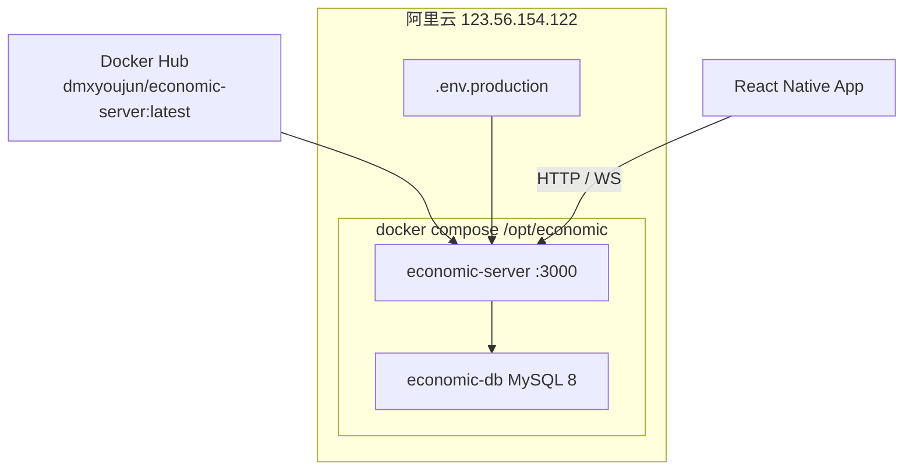
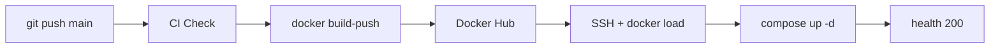
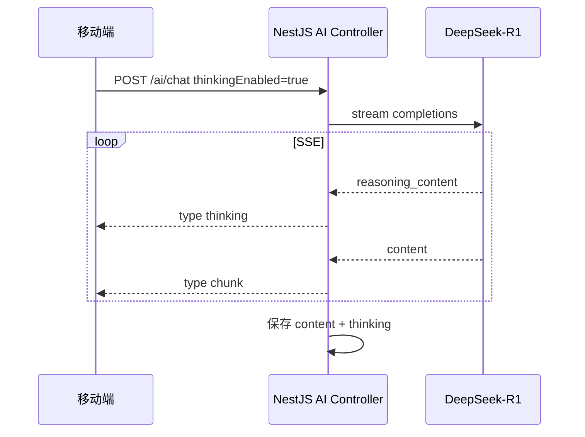
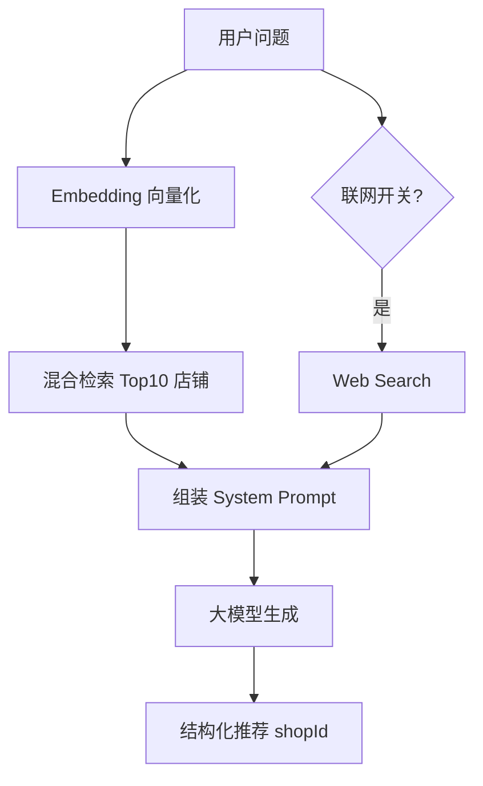
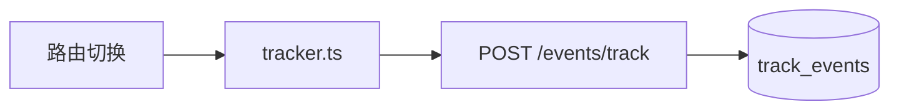
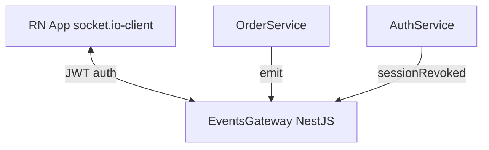

# 经济生活 App 项目答辩 — 技术亮点（3W1H）

> **用途**：按章节拆成 PPT 页；每节含「一页标题 + 3W1H 四格 + 可选讲稿要点」。  
> **项目**：pnpm Monorepo（React Native 移动端 + NestJS 后端 + Prisma + MySQL）  
> **生产验证**：阿里云 `123.56.154.122:3000`，镜像 `dmxyoujun/economic-server:latest`，`/health` 返回 200。

---

## 答辩总览（建议封面后第 1 页）

| 维度 | 内容 |
|------|------|
| **What** | 本地生活 / 外卖类 App，含店铺浏览、下单支付、AI 美食助手、订单实时追踪 |
| **Why** | 用工程化交付（容器 + CI/CD）保障可部署；用 AI + 实时通信 + 数据埋点提升体验与可运营性 |
| **Who** | 终端用户（Android App）；运维/开发（GitHub Actions + Docker）；产品/运营（埋点数据） |
| **How** | Monorepo 统一开发 → GitHub 自动构建 → Docker 镜像 → 云服务器 Compose 运行 → App 调用 REST / SSE / WebSocket |

**建议讲解顺序**：Docker 部署 → CI/CD → 埋点 → WebSocket → AI（对话 / 思考 / RAG）— 由「基础设施」到「业务智能」。

---

# 亮点一：Docker 容器化部署

## 3W1H

| | 说明 |
|---|------|
| **What（是什么）** | 将 NestJS 后端打成 **多阶段 Docker 镜像**，与 **MySQL 8** 通过 `docker-compose` 在同一虚拟网络中运行；容器自带 **健康检查**，启动时自动执行 Prisma 迁移。 |
| **Why（为什么做）** | 开发环境与生产一致，避免「在我机器能跑」；一键扩缩、回滚只需换镜像 tag；数据库与应用隔离，便于备份与升级。 |
| **Who / Where（谁用 / 在哪）** | **开发**：本地可用相同 Dockerfile 验证；**运维**：阿里云 `/opt/economic`；**镜像仓库**：Docker Hub `dmxyoujun/economic-server`。 |
| **How（怎么做）** | ① `apps/server/Dockerfile`：builder 阶段 `pnpm build:server` + `prisma generate`；production 阶段仅保留 dist、依赖与 entrypoint。② `scripts/server-docker-compose.yml`：`server` + `db` 两服务，`depends_on` 健康检查。③ 启动命令：`prisma migrate deploy` → `node dist/src/main`。④ `HEALTHCHECK` 轮询 `/health`。 |

## 技术要点（可做成 PPT  bullet）

- **多阶段构建**：构建层与运行层分离，镜像体积更小、攻击面更小。
- **双容器架构**：`economic-server`（Node 22 Alpine）+ `economic-db`（MySQL 8，数据卷 `db-data`）。
- **环境注入**：`/opt/economic/.env.production`（JWT、OSS、短信、高德、AI Key 等），不写进镜像。
- **已验证状态**：服务器上 `economic-server`、`economic-db` 均为 `healthy`；公网 `http://123.56.154.122:3000/health` 正常。

## 架构图（建议贴进 PPT）

## 答辩讲稿（30 秒）

> 我们把后端做成了标准 Docker 镜像，生产和本地用同一套 Dockerfile。服务器上用 Compose 拉起 API 和 MySQL，启动时自动跑数据库迁移，并通过 healthcheck 保证容器健康。目前镜像已部署在阿里云，公网健康检查通过。

## 关键文件索引

- `apps/server/Dockerfile`
- `apps/server/docker-entrypoint.sh`
- `scripts/server-docker-compose.yml`

---

# 亮点二：CI/CD 持续集成与持续部署

## 3W1H

| | 说明 |
|---|------|
| **What（是什么）** | 基于 **GitHub Actions** 的两条流水线：`CI/CD`（代码质量 + Android 打包）与 `Deploy to Production`（构建镜像、推送仓库、SSH 滚动更新）。 |
| **Why（为什么做）** | 每次 push 到 `main` 自动验证能否编译、能否出包；合并后自动部署，减少人工登录服务器操作与人为失误。 |
| **Who / Where（谁用 / 在哪）** | **开发者**：提交即触发；**GitHub**：`douminxiang/economic` 仓库 Actions；**生产机**：SSH 部署到 `/opt/economic`。 |
| **How（怎么做）** | **Deploy 三阶段 Job**：`CI Check`（install → prisma generate → lint/test/build）→ `Build & Push`（buildx 构建并 push `latest` + `sha-xxx`）→ `Deploy`（`docker pull` → `docker save \| ssh docker load` → `scp compose` → `docker compose up` → `curl /health`）。**CI/CD 工作流**：Lint、Test、Android `bundleRelease`（Hermes、签名）。 |

## 流水线示意（PPT 一页）

## 技术要点

| 工作流 | 触发 | 产出 |
|--------|------|------|
| `.github/workflows/deploy.yml` | push `main` / 手动 dispatch | 生产镜像 + 服务器更新 |
| `.github/workflows/ci.yml` | push / PR `main` | Lint、单测、Android AAB |

- **密钥管理**：`DOCKER_*`、`SSH_*`、`DB_PASSWORD`、`JWT_*` 存 GitHub Secrets，不进仓库。
- **部署优化**：镜像经 `docker save | ssh docker load` 直传，避免大文件 SCP 权限问题。
- **可演示数据**：最近一次 Deploy / CI 均为 **success**；生产 `/health`、业务 API 已冒烟通过。

## 答辩讲稿（30 秒）

> 我们实现了从代码提交到上线的全自动流水线。Push 到 main 后，GitHub 先跑 CI 编译检查，再构建 Docker 镜像推到 Hub，最后 SSH 到云服务器加载镜像并用 Compose 重启服务，部署结束会自动 curl 健康检查。Android 侧同一条 CI 流水线还能打出签名的 Release 包。

## 关键文件索引

- `.github/workflows/deploy.yml`
- `.github/workflows/ci.yml`

---

# 亮点三：AI 对话、深度思考、RAG

> 答辩时可拆成 **3 页**：① AI 对话总览 ② 深度思考 ③ RAG；或合并为「智能美食助手」一章。

---

## 3.1 AI 对话（流式 SSE）

### 3W1H

| | 说明 |
|---|------|
| **What** | 端侧 **AI 美食助手**：多轮对话、历史会话、流式打字机效果；支持 **图片多模态**（菜品识图推荐）。 |
| **Why** | 用自然语言降低找店成本，结合平台真实店铺数据，避免「空聊」；流式输出提升交互体验。 |
| **Who / Where** | 登录用户；移动端 `AIScreen`；后端 `POST /api/v1/ai/chat`（JWT）。 |
| **How** | 后端调 SiliconFlow OpenAI 兼容 API；`stream: true`；Controller 解析 SSE，向客户端推送 `type: chunk`；消息落库 `AIConversation` / `AIMessage`。 |

### 模型策略

| 场景 | 模型 | 说明 |
|------|------|------|
| 默认对话 | DeepSeek-V3.2 | 快速回复 |
| 深度思考开启 | DeepSeek-R1 | 输出 `reasoning_content` |
| 带图消息 | Qwen3-VL | 图文多模态 |

### 答辩讲稿（20 秒）

> 用户可以在 App 里和「美食达人 AI」多轮对话。服务端用流式接口把回答一段段推给手机，体验类似 ChatGPT。带图时自动切换视觉模型，识别菜品后再结合平台店铺推荐。

---

## 3.2 深度思考（Deep Thinking）

### 3W1H

| | 说明 |
|---|------|
| **What** | 用户打开 **「深度思考」** 开关后，模型先输出 **推理过程（thinking）**，再输出最终答案；推理内容可折叠展示并持久化。 |
| **Why** | 复杂推荐（对比多家、预算+口味+场景）需要链式推理；展示思考过程增强可信度，便于答辩演示差异化。 |
| **Who / Where** | 用户 toggles `thinkingEnabled`；`AIScreen` + `ChatBubble` 展示；库表字段 `AIMessage.thinking`。 |
| **How** | 请求体 `thinkingEnabled: true` → 选用 **DeepSeek-R1** → 解析流中 `delta.reasoning_content` → SSE 事件 `type: thinking` → 前端 `updateLastAssistantThinking` → 落库 `saveAssistantMessage(..., fullThinking)`。 |

### 数据流（PPT 图）

### 答辩讲稿（25 秒）

> 深度思考对应 DeepSeek-R1 模型。我们把推理链和最终回答分开流式传输，界面上可以展开「思考过程」，并写入数据库，方便用户回看。答辩现场可以打开开关问一道复合题，例如「人均 50、想吃辣、适合聚餐」。

---

## 3.3 RAG（检索增强生成）

### 3W1H

| | 说明 |
|---|------|
| **What** | **RAG** = 用户提问前，从 **平台 MySQL 商家库** 检索相关店铺/菜品，注入 System Prompt，让大模型 **只基于真实数据** 推荐（含 `shopId` 结构化卡片）。可选 **联网搜索** 作补充。 |
| **Why** | 纯 LLM 易幻觉假店名；RAG 把推荐锚定在业务数据上，可点击跳转店铺详情，形成闭环。 |
| **Who / Where** | 所有 AI 对话请求；`EmbeddingService` + `AiService.buildDbContext`；店铺表 `Shop.embedding`（向量 JSON）。 |
| **How** | ① **向量化**：`BAAI/bge-large-zh-v1.5` 生成 query embedding。② **混合检索**：`hybridSearch` = 余弦相似度 × 0.7 + 关键词匹配 × 0.3。③ **降级**：向量失败 → 关键词 SQL；无匹配 → 热销 Top 店铺。④ **Prompt**：`formatShopData` 写入系统提示，要求 `shopId` 必须来自 `[id:n]`。⑤ **联网**（可选）：DuckDuckGo HTML 解析，拼入「联网搜索参考」段落。 |

### RAG 链路图（强烈建议放 PPT）

### 与「经典文档 RAG」的区别（答辩可能被问）

| 本项目 | 经典文档 RAG |
|--------|----------------|
| 检索源 = **业务库 Shop/Product** | 检索源 = PDF/知识库切片 |
| 向量存在 **MySQL JSON 字段** | 常用 Pinecone / Milvus |
| 输出强制 **shopId 对齐** | 输出多为纯文本 |

### 答辩讲稿（35 秒）

> RAG 方面我们没有让模型瞎编餐厅，而是先把用户问题向量化，在数据库里做向量加关键词的混合检索，把真实店铺、价格、招牌菜写进系统提示里。回答里必须带 shopId，方便用户一键进店。另外还支持可选的联网搜索，把外部美食资讯作为参考，和平台数据一起生成答案。

### 关键文件索引

- `apps/server/src/modules/ai/ai.service.ts`
- `apps/server/src/modules/ai/embedding.service.ts`
- `apps/server/src/modules/ai/search.service.ts`
- `apps/server/src/modules/ai/ai.controller.ts`
- `apps/mobile/src/screens/AIScreen.tsx`

---

# 亮点四：埋点监控（Analytics）

## 3W1H

| | 说明 |
|---|------|
| **What** | 端侧 **行为埋点** + 服务端 **事件入库**（`track_events` 表），记录页面浏览、自定义点击等；用户可在设置中 **关闭统计**。 |
| **Why** | 支撑产品迭代：哪些页面停留、哪些功能使用；问题排查时有用户路径；符合隐私合规（可关闭、失败不阻塞）。 |
| **Who / Where** | **用户**：匿名或登录态均可上报；**产品/开发**：查 MySQL / 后续可接 BI；**实现**：`tracker.ts` → `POST /api/v1/events/track`。 |
| **How** | ① 客户端 `trackPageView` 挂载在 `RootNavigator` 路由切换。② `trackEvent` 用于业务自定义事件。③ `deviceId` 本地 MMKV 持久化。④ 服务端 `OptionalJwtAuthGuard`：有 token 记 `userId`，无则 null。⑤ `AnalyticsService` 写库失败只打日志 **不抛错**，不影响主流程。 |

## 事件模型（PPT 表格）

| 字段 | 含义 | 示例 |
|------|------|------|
| eventType | 事件类型 | `page_view` / `custom` |
| eventName | 事件名 | `HomeScreen`、`pay_button_tap` |
| properties | 扩展 JSON | `{ shopId: 1 }` |
| platform | 平台 | `android` |
| appVersion | 版本 | `1.0.0` |
| deviceId | 设备标识 | `d_xxx` |

## 数据流

## 答辩讲稿（25 秒）

> 埋点方面我们在导航层自动采集页面 PV，业务代码可以打自定义事件。数据落到 MySQL，登录用户会关联 userId。设计上强调「统计不能拖垮业务」——上报失败静默、用户可在设置里关掉分析。

## 关键文件索引

- `apps/mobile/src/utils/tracker.ts`
- `apps/mobile/src/navigation/RootNavigator.tsx`
- `apps/server/src/modules/analytics/`
- `apps/server/prisma/schema.prisma` → `TrackEvent`

---

# 亮点五：WebSocket 实时通信

## 3W1H

| | 说明 |
|---|------|
| **What** | 基于 **Socket.IO** 的双向通道：订单状态推送、骑手位置模拟、多端登录 **会话踢下线** 通知。 |
| **Why** | 订单配送需要 **秒级更新**，轮询费电、延迟高；账号安全需要实时告知「别处登录」。 |
| **Who / Where** | 已登录且 JWT 带 `sid` 的客户端；`EventsGateway`；移动端 `socket.ts` + `useOrderRealtime`。 |
| **How** | ① 连接时校验 JWT + `AuthSessionService.assertSessionActive`。② 用户加入房间 `user:{userId}`。③ 订单位置：客户端 `emit('trackOrder')` → 加入 `order:{orderId}` → 服务端定时 `emit('order:riderLocation')`。④ 状态变更：`OrderService` 调 `emitOrderStatusChanged`。⑤ 登出/顶号：`emitSessionRevoked`。 |

## 事件一览（PPT 表格）

| 方向 | 事件名 | 用途 |
|------|--------|------|
| C→S | `trackOrder` / `untrackOrder` | 订阅/取消订单房间 |
| S→C | `order:statusChanged` | 订单状态变更 |
| S→C | `order:riderLocation` | 骑手经纬度、预计送达 |
| S→C | `auth:sessionRevoked` | 会话失效（异地登录等） |

## 架构图

## 答辩讲稿（30 秒）

> WebSocket 用来解决实时性要求高的场景。用户打开订单详情会订阅该订单房间，服务端推送状态和骑手位置，不用反复刷新。另外我们把单点登录和 WebSocket 打通，账号在另一台设备登录时，当前设备会立刻收到踢下线事件。

## 关键文件索引

- `apps/server/src/modules/events/events.gateway.ts`
- `apps/mobile/src/services/socket.ts`
- `apps/mobile/src/hooks/useOrderRealtime.ts`

---

# 附录 A：建议 PPT 页结构（共约 15–18 页）

1. 封面 — 项目名称、答辩人、技术栈  
2. 项目背景与架构总览（Monorepo 示意图）  
3. **Docker** — 3W1H + Compose 架构图  
4. **CI/CD** — 流水线图 + GitHub Actions 截图位  
5. **埋点** — 3W1H + 事件表 + 数据流  
6. **WebSocket** — 3W1H + 事件表 + 订单页截图位  
7. **AI 总览** — 美食助手能力矩阵  
8. **AI 对话** — 流式 SSE 时序图  
9. **深度思考** — R1 推理链 UI 截图位  
10. **RAG** — 混合检索流程图 + shopId 卡片示例  
11. 生产部署演示 — `/health`、店铺 API（可录屏）  
12. 技术栈与难点总结  
13. 展望 — HTTPS 域名、数据看板、向量库独立化等  
14. Q&A  

---

# 附录 B：现场演示脚本（约 3 分钟）

| 顺序 | 操作 | 对应亮点 |
|------|------|----------|
| 1 | 手机浏览器打开 `http://123.56.154.122:3000/health` | Docker 部署 |
| 2 | 展示 GitHub Actions 最近一次绿色 Deploy | CI/CD |
| 3 | App 切换两个页面，说明后台有 PV（可展示 DB `track_events`） | 埋点 |
| 4 | 打开订单详情，展示连接状态/骑手点移动 | WebSocket |
| 5 | AI 页：普通一问 → 开「深度思考」再问 → 开「联网」再问 | AI + RAG |

---

# 附录 C：评委常问 & 参考答法

| 问题 | 参考答法 |
|------|----------|
| RAG 向量存在哪？ | 存在 MySQL `Shop.embedding` JSON；检索时内存算余弦相似度；量大后可迁 Milvus。 |
| 深度思考和普通模式区别？ | 模型从 V3.2 切到 R1，多一路 `reasoning_content` 流式通道并入库。 |
| CI 挂了会部署吗？ | Deploy 里 lint/test 用了容错 `|| true`，主要门禁是 build 镜像与远端 health；可改进为严格失败即中断。 |
| 埋点和 Sentry 关系？ | 当前以 **自研入库** 为主；规划文档提及 Sentry，答辩可说「埋点自有、崩溃监控可扩展」。 |
| WebSocket 和 HTTP 鉴权一致吗？ | 一致，握手带 JWT，并校验 `sid` 会话是否仍有效。 |

---

# 附录 D：技术栈一览（可做尾页）

| 层次 | 技术 |
|------|------|
| 移动端 | React Native、TypeScript、React Navigation、TanStack Query、MMKV |
| 后端 | NestJS、Prisma、MySQL、Socket.IO、JWT + 双 Token 会话 |
| AI | SiliconFlow API、DeepSeek-V3.2 / R1、BGE 中文向量、Qwen-VL |
| 运维 | Docker、Docker Compose、GitHub Actions、阿里云 ECS、Docker Hub |

---

*文档版本：2026-06-04 · 与仓库 `main` 分支实现一致*
